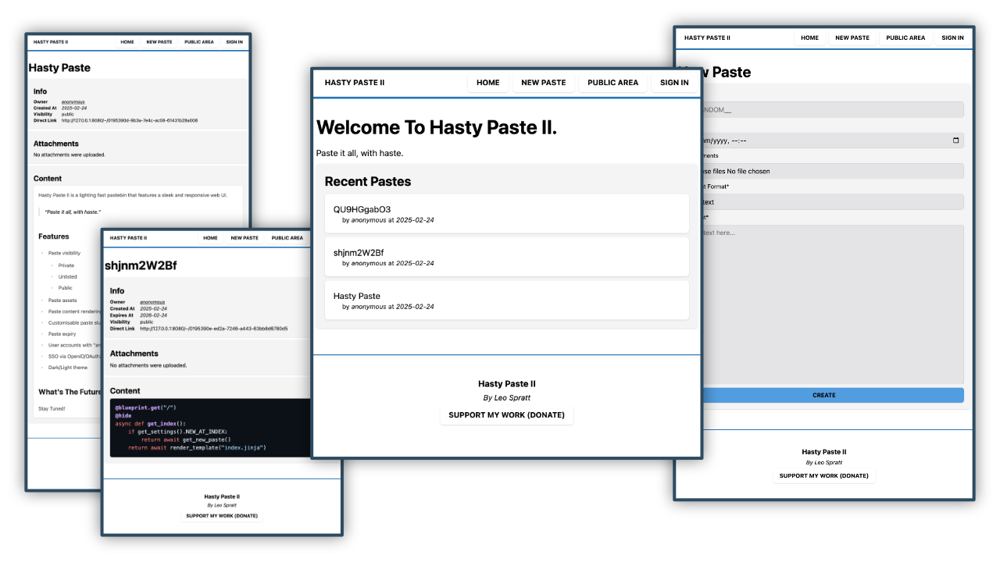

# Hasty Paste II
Paste it all, with haste.

Docs available at: [hastypaste.docs.enchantedcode.co.uk](https://hastypaste.docs.enchantedcode.co.uk/)

## Showcase

## Features
- Paste visibility
    - Private
    - Unlisted
    - Public
- Paste assets
- Paste content rendering (plain, markdown, code)
- Customisable paste slug (or random)
- Paste expiry
- User accounts with "anonymous" mode
- SSO via OpenID/OAuth2
- Dark/Light theme

## Demo Video

<https://youtu.be/s_RX7hmnrGw>

## Support Me
Like this project? Consider supporting me financially so I can continue development.

## License
This project is Copyright (c) 2025 Leo Spratt, licences shown below:

Code

    AGPL-3 or any later version. Full license found in `LICENSE.txt`

Documentation

    FDLv1.3 or any later version. Full license found in `docs/LICENSE.txt`

Icon/Mark

    All Rights Reserved
